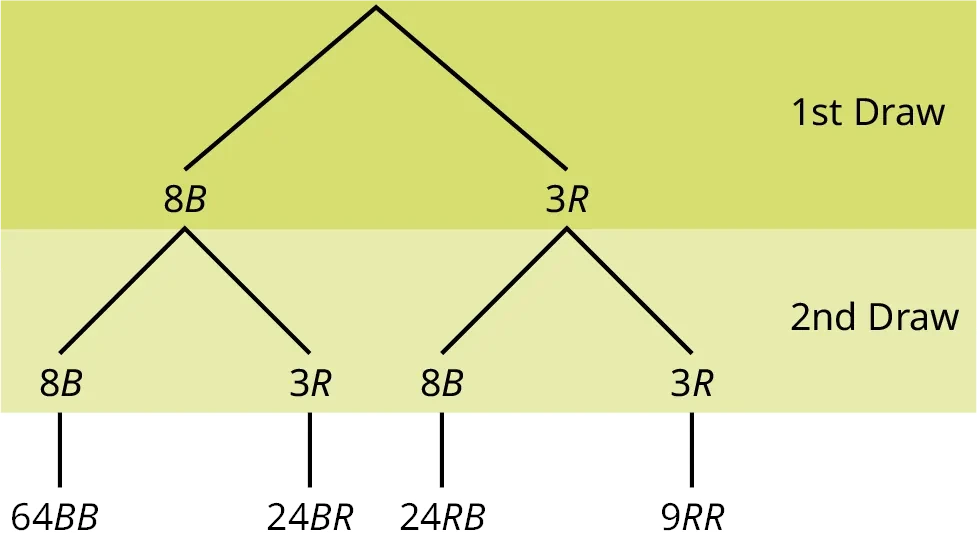
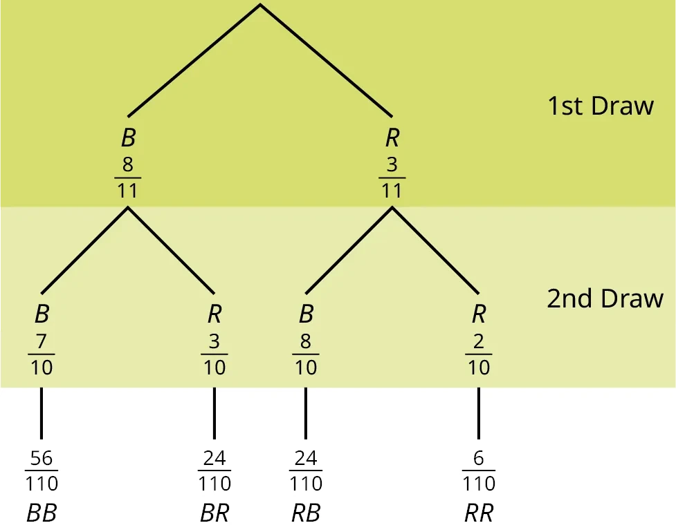

# 3.0 Probability

Probability is a numerical way to describe uncertainty. It tells us how likely an outcome or event is, using values between 0 and 1.

- $P(A) = 0$ means event $A$ is impossible
- $P(A) = 1$ means event $A$ is certain
- probabilities between 0 and 1 measure different levels of likelihood
- if two outcomes are equally likely, they have the same probability

Probability can be understood in two related ways:

- **theoretical probability** comes from a mathematical model
- **empirical probability** comes from observed data

Over many repetitions of the same experiment, empirical results tend to move closer to theoretical values. This is the idea behind the **law of large numbers**.

## 3.1 Terminology

### Experiment

An **experiment** is a process or action that produces an outcome.

- flipping a coin
- rolling a die
- drawing a card
- selecting a person from a group

A **chance experiment** is an experiment whose outcome is not known in advance.

### Outcome

An **outcome** is one specific result of an experiment.

Examples:

- when rolling one die, an outcome could be 4
- when flipping two coins, an outcome could be HT

### Sample Space

The **sample space** is the set of all possible outcomes of an experiment.

It is often written as $S$.

Examples:

- one coin flip: $S = \{H, T\}$
- one die roll: $S = \{1,2,3,4,5,6\}$
- two coin flips: $S = \{HH, HT, TH, TT\}$

A sample space can be represented in several ways:

- as a list
- as a tree diagram
- as a Venn diagram

### Event

An **event** is a collection of one or more outcomes from the sample space.

Events are usually labeled with capital letters such as $A$, $B$, and $C$.

Examples for rolling one die:

- $A = \{2,4,6\}$ means “roll an even number”
- $B = \{1,2,3\}$ means “roll a number less than 4”
- $C = \{5\}$ means “roll a 5”

The probability of event $A$ is written $P(A)$.

### Equally Likely Outcomes

Outcomes are **equally likely** if each outcome has the same chance of occurring.

Examples:

- outcomes of a fair coin are equally likely
- outcomes of a fair die are equally likely

If outcomes are equally likely and the sample space is finite, then:

$$
P(A) = \frac{|A|}{|S|}
$$

where:

- $|A|$ is the number of outcomes in event $A$
- $|S|$ is the number of outcomes in the sample space

Example:

If a fair die is rolled and $A = \{2,4,6\}$, then:

$$
P(A) = \frac{3}{6} = \frac{1}{2}
$$

### The Law of Large Numbers

If the same experiment is repeated many times, the relative frequency of an outcome tends to get closer to its theoretical probability.

Example:

- in a small number of coin flips, heads may not appear exactly half the time
- in a very large number of flips, the proportion of heads should move closer to $0.5$

### Biased Outcomes

A process is **biased** if outcomes are not equally likely.

Examples:

- a loaded die
- a weighted coin

A biased process still has probabilities. The difference is that the outcomes no longer all have the same probability.

### Union: “OR”

The event $A \cup B$ means:

- outcome is in $A$
- or in $B$
- or in both

This is called the **union** of $A$ and $B$.

Example:

Let

- $A = \{1,2,3,4\}$
- $B = \{3,4,5,6\}$

Then

$$
A \cup B = \{1,2,3,4,5,6\}
$$

### Intersection: “AND”

The event $A \cap B$ means the outcome is in both $A$ and $B$.

This is called the **intersection** of $A$ and $B$.

Example:

Let

- $A = \{1,2,3,4\}$
- $B = \{3,4,5,6\}$

Then

$$
A \cap B = \{3,4\}
$$

### Complement

The **complement** of event $A$ is the event that $A$ does not occur.

It is written $A^c$ or sometimes $A'$.

Key rule:

$$
P(A) + P(A^c) = 1
$$

equivalently,

$$
P(A^c) = 1 - P(A)
$$

Example:

If $A =$ rolling an even number on a fair die, then

- $A = \{2,4,6\}$
- $A^c = \{1,3,5\}$

### Conditional Probability

A **conditional probability** is the probability that event $A$ occurs given that event $B$ has already occurred.

It is written:

$$
P(A \mid B)
$$

Formula:

$$
P(A \mid B) = \frac{P(A \cap B)}{P(B)}
\quad \text{provided } P(B) > 0
$$

Interpretation:

- the original sample space is reduced to $B$
- then we ask how much of $B$ also belongs to $A$

Example:

Roll one fair die.

Let

- $A = \{2,3\}$
- $B = \{2,4,6\}$

Then:

- $A \cap B = \{2\}$
- $P(A \mid B) = \frac{1/6}{3/6} = \frac{1}{3}$

## 3.2 Independent and Mutually Exclusive Events

Independent events and mutually exclusive events are different ideas.

### Independent Events

Two events are **independent** if knowing that one occurred does not change the probability of the other.

Equivalent tests for independence is if two events are independent if any one of the following equivalent conditions holds:

1. $ P(A \mid B) = P(A) $
1. $ P(B \mid A) = P(B) $
1. $ P(A \cap B) = P(A)P(B) $

To prove independence, it is enough to verify one of these conditions.

Example:

Let

- $A =$ first coin flip is heads
- $B =$ second coin flip is heads

Then the result of the first flip does not affect the second, so $A$ and $B$ are independent.

### Dependent Events

Two events are **dependent** if the occurrence of one changes the probability of the other.

Example:

Drawing two cards from a deck **without replacement** creates dependence, because the first draw changes the composition of the deck.

### Sampling With and Without Replacement

#### With Replacement

When an item is replaced after selection, the pool does not change.

- later probabilities stay the same
- events are treated as independent

#### Without Replacement

When an item is not replaced, the pool changes.

- later probabilities change
- events are dependent

### Mutually Exclusive Events

Two events are **mutually exclusive** if they cannot happen at the same time.

That means:

$$
A \cap B = \varnothing
$$

and therefore:

$$
P(A \cap B) = 0
$$

Example:

Roll one die.

Let

- $A = \{1,2\}$
- $B = \{5,6\}$

Then $A$ and $B$ are mutually exclusive because no single roll can be in both sets.

### Important Distinction

- **independent** means one event does not affect the probability of the other
- **mutually exclusive** means the two events cannot happen together

These are not the same.

In fact, if two events with positive probability are mutually exclusive, then they are not independent.

Why?

If $A$ and $B$ are mutually exclusive, then:

$$
P(A \cap B) = 0
$$

But if they were independent, we would need:

$$
P(A \cap B) = P(A)P(B)
$$

If both $P(A)$ and $P(B)$ are positive, then $P(A)P(B) > 0$, which contradicts mutual exclusivity.

### Safe Defaults

- if independence is not justified, do not assume it
- if mutual exclusivity is not clear, do not assume it
- begin with the general rule, then simplify only when the conditions are known

## 3.3 Two Basic Rules of Probability

### The Multiplication Rule

For any two events $A$ and $B$:

$$
P(A \cap B) = P(B)P(A \mid B)
$$

This can also be written as:

$$
P(A \cap B) = P(A)P(B \mid A)
$$

If $A$ and $B$ are independent, then:

$$
P(A \cap B) = P(A)P(B)
$$

#### Example Multiplication Rule

Suppose:

- $P(A) = 0.6$
- $P(B \mid A) = 0.3$

Then:

$$ 
P(A \cap B) = 0.6(0.3) = 0.18
$$

### The Addition Rule

For any two events $A$ and $B$:

$$
P(A \cup B) = P(A) + P(B) - P(A \cap B)
$$

Why subtract?

Because the outcomes in the union of $A$ and $B$ get counted twice when you add $P(A)$ and $P(B)$.

If $A$ and $B$ are mutually exclusive, then $P(A \cap B)=0$, so the rule simplifies to:

$$
P(A \cup B) = P(A) + P(B)
$$

#### Example: Addition Rule

Suppose:

- $P(A) = 0.40$
- $P(B) = 0.35$
- $P(A \cap B) = 0.10$

Then:

$$
P(A \cup B) = 0.40 + 0.35 - 0.10 = 0.65
$$

### Strategy for Two-Event Problems

When solving probability questions involving two events, ask:

1. Is the question asking for AND, OR, or GIVEN?
2. Is there overlap between the events?
3. Are the events independent?
4. Are the events mutually exclusive?

Use:

- AND $\rightarrow$ [multiplication rule](#the-multiplication-rule)
- OR $\rightarrow$ [addition rule](#the-addition-rule)
- GIVEN $\rightarrow$ [conditional probability formula](#conditional-probability)

## Compacted conversationI'll rewrite Section 3.4 to keep your contingency table examples integrated with clearer explanations of how to extract different types of probabilities from the tables. Let me first read the full context of what's currently in the file. 

Read [](file:///home/jadedrakerider/Workspace/Python3/Python-and-Statistics/alg-statistics-03-probability.md#1-1), lines 1 to 450

Read [](file:///home/jadedrakerider/Workspace/Python3/Python-and-Statistics/alg-statistics-03-probability.md#450-450), lines 450 to 610

Now I'll rewrite Section 3.4 to integrate your tables clearly with explanations of how to extract each type of probability. I'll also fix an error I notice in Example 3.23 (the first problem uses the addition rule incorrectly for finding an intersection). 

Read [](file:///home/jadedrakerider/Workspace/Python3/Python-and-Statistics/alg-statistics-03-probability.md#435-435), lines 435 to 610

Now I'll rewrite Section 3.4 with better organization that flows from table structure → probability types → applying rules to tables. I'll keep your examples and fix a couple of errors I noticed. 

Read [](file:///home/jadedrakerider/Workspace/Python3/Python-and-Statistics/alg-statistics-03-probability.md#417-417), lines 417 to 610

I'll create a comprehensive rewrite of Section 3.4. This version will flow better, integrate your tables as primary teaching examples, and fix the errors in Example 3.23. 

Read [](file:///home/jadedrakerider/Workspace/Python3/Python-and-Statistics/alg-statistics-03-probability.md)

Now I'll create the replacement text for Section 3.4. This will keep your examples and reorganize the content to flow more logically.

Based on my analysis, I need to rewrite Section 3.4 starting at line 417. Here's a comprehensive rewrite that:

1. **Flows logically**: Reading tables → extracting probabilities → applying rules → testing independence
2. **Integrates your examples**: Uses them as primary teaching tools with clear explanations
3. **Fixes errors**: The first problem in Example 3.23 and the conditional probability in the last problem
4. **Adds clarity**: Shows exactly what part of the table to use for each probability type

Here's the new Section 3.4 to replace lines 417-610:

## 3.4 Contingency Tables

A **contingency table** organizes counts for two categorical variables and displays all possible combinations of outcomes for both variables.

It is useful for:

- computing probabilities directly from observed data
- identifying relationships between categorical variables
- testing whether events are independent

### Reading a Contingency Table

The structure of any contingency table follows a consistent pattern:

- **interior cells** contain **joint counts** (observations in both categories)
- **row totals** (rightmost column) contain **marginal counts** for that row
- **column totals** (bottom row) contain **marginal counts** for that column
- **grand total** (bottom-right cell) is the total sample size $N$

### The Three Types of Probabilities from a Table

Given a contingency table with sample size $N$:

#### Marginal Probability

A **marginal probability** is the probability of one event, ignoring the other variable.

$$
P(\text{event}) = \frac{\text{row total or column total}}{N}
$$

The name "marginal" comes from reading values in the *margins* (edges) of the table.

#### Joint Probability

A **joint probability** is the probability that both events occur together.

$$
P(A \cap B) = \frac{\text{interior cell count}}{N}
$$

The interior cell already contains the count of outcomes in the intersection, so use it directly.

#### Conditional Probability

A **conditional probability** is the probability of one event given that another has occurred.

$$
P(A \mid B) = \frac{\text{interior cell (the intersection)}}{B\text{'s row or column total (the condition)}}
$$

The key: when you condition on event $B$, the *reduced sample space* becomes $B$'s total, not $N$.

### Example 3.20: Cell Phone Use and Speeding Violations

Suppose a study of speeding violations  and drivers who use cell phones in the last year produced the following data:

|                                 | Speeding violation | No speeding violation | Total |
|---------------------------------| ------------------ | --------------------- | ----- |
| Uses cell phone while driving   |                25                   |                 280                    |  305  |
| Does not use cell phone while driving |            45                   |                 405                    |  450  |
| Total                          |                70                   |                 685                    |  755  |

The total sample size is $N = 755$.

**Understanding the table:**
- Row 1 total (305): drivers who use cell phones
- Row 2 total (450): drivers who do not use cell phones
- Column 1 total (70): drivers with violations
- Column 2 total (685): drivers without violations
- Interior cells: counts of drivers in each combination

**Extracting probabilities:**

a. **Marginal probability — P(Driver is a cell phone user)**

This is just one category, so use the row total:
$$P(U) = \frac{305}{755}$$

b. **Marginal probability — P(Driver had no violation)**

$$P(V^c) = \frac{685}{755}$$

c. **Joint probability — P(Driver had no violation AND was a cell phone user)**

Find the interior cell where these overlap (row 1, column 2):
$$P(V^c \cap U) = \frac{280}{755}$$

Note: Do not compute this indirectly using the addition rule. The cell already contains the intersection count.

d. **Application of addition rule — P(Driver is a cell phone user OR driver had no violation)**

Use the addition rule formula $P(A \cup B) = P(A) + P(B) - P(A \cap B)$:
$$P(U \cup V^c) = \frac{305 + 685 - 280}{755} = \frac{710}{755}$$

e. **Conditional probability — P(Driver is a cell phone user | driver had a violation)**

Given that the driver had a violation, the reduced sample space is the "violation" column (total = 70).
Of those, 25 used a cell phone:
$$P(U \mid V) = \frac{25}{70}$$

f. **Conditional probability — P(Driver had no violation | driver was not a cell phone user)**

Given that the driver does not use a cell phone, the reduced sample space is row 2 (total = 450).
Of those, 405 had no violation:
$$P(V^c \mid U^c) = \frac{405}{450}$$

### Testing Independence Using Contingency Tables

Two events $A$ and $B$ are **independent** if any of these equivalent conditions holds:

1. $P(A \mid B) = P(A)$
2. $P(B \mid A) = P(B)$
3. $P(A \cap B) = P(A) \cdot P(B)$

In a contingency table, check the third condition: compute $P(A \cap B)$ directly from the table, then compute $P(A) \cdot P(B)$ using marginal probabilities. If they are equal, the events are independent.

### Example 3.21: Hiking Preferences by Gender

This example shows a random sample of 100 hikers and their preferred hiking areas.

**Incomplete table:**

| Sex    | The Coastline | Near Lakes and Streams| On Mountain Peaks | Total |
|--------|:-------------:|:---------------------:|:-----------------:|:-----:|
| Women  |      18       |          16           |                   |  45   |
| Men    |               |                       |        14         |  55   |
| Total  |               |          41           |                   |       |

**a. Fill in the missing values**

Work from row totals and column totals:

| Sex    | The Coastline | Near Lakes and Streams| On Mountain Peaks | Total |
|--------|:-------------:|:---------------------:|:-----------------:|:-----:|
| Women  |      18       |          16           |        11         |  45   |
| Men    |      16       |          25           |        14         |  55   |
| Total  |      34       |          41           |        25         | 100   |

**b. Test independence: Are "being a woman" and "preferring the coastline" independent?**

Let $F$ = being a woman and $C$ = preferring the coastline.

Condition 3: Check if $P(F \cap C) = P(F) \cdot P(C)$

From the table:
- $P(F \cap C) = \frac{18}{100} = 0.18$ (interior cell ÷ grand total)
- $P(F) = \frac{45}{100} = 0.45$ (row total ÷ grand total)
- $P(C) = \frac{34}{100} = 0.34$ (column total ÷ grand total)
- $P(F) \cdot P(C) = 0.45 \times 0.34 = 0.153$

Since $0.18 \neq 0.153$, the events are **not independent**. Gender and coastline preference are related in this sample.

**c. Conditional probability: P(Man | Prefers lakes and streams)**

Let $M$ = being a man and $L$ = prefers hiking near lakes and streams.

Given preference for lakes (the condition), the reduced sample space is the "Near Lakes and Streams" column (total = 41).
Of those, 25 are men:
$$P(M \mid L) = \frac{25}{41}$$

The sample space for this problem is not all 100 hikers—it is the 41 people who prefer lakes and streams.

**d. Union probability: P(Woman OR prefers mountain peaks)**

Let $F$ = being a woman and $P$ = prefers mountain peaks.

Using the addition rule:
$$P(F \cup P) = P(F) + P(P) - P(F \cap P)$$
$$= \frac{45}{100} + \frac{25}{100} - \frac{11}{100} = \frac{59}{100}$$

### Example 3.23: Crime Rates by Year and Type

This table shows crime rates (per 100,000 population) across four years and four crime categories:

| Year  |  Robbery  | Burglary  | Vandalism |  Vehicle Theft  |    Total  |
|-------|-----------|-----------|-----------|-----------------|-----------|
|   1   |     145.7 |     732.1 |      29.7 |     314.7       |    1222.2 |
|   2   |     133.1 |     717.7 |      29.1 |     259.2       |    1139.1 |
|   3   |     119.3 |     701.0 |      27.7 |     239.1       |    1087.1 |
|   4   |     113.7 |     702.2 |      26.8 |     229.6       |    1072.3 |
| Total |     511.8 |    2853.0 |     113.3 |    1042.6       |    4520.7 |

#### a. Joint probability — Find P(Year 2 AND Robbery)

Let $Y_2$ = year 2 and $R$ = robbery.

The intersection is the interior cell at year 2, robbery column:
$$P(Y_2 \cap R) = \frac{133.1}{4520.7} \approx 0.0294$$

Note: This is read directly from the table. Do *not* use the addition rule for intersections; the cell already contains what you need.

#### b. Joint probability — Find P(Year 3 AND Burglary)

$$P(Y_3 \cap B) = \frac{701.0}{4520.7} \approx 0.1551$$

#### c. Union probability — Find P(Year 3 OR Burglary)

Let $Y_3$ = year 3 and $B$ = burglary.

Using the addition rule:
$$P(Y_3 \cup B) = P(Y_3) + P(B) - P(Y_3 \cap B)$$
$$= \frac{1087.1}{4520.7} + \frac{2853.0}{4520.7} - \frac{701.0}{4520.7}$$
$$= \frac{1087.1 + 2853.0 - 701.0}{4520.7} = \frac{3239.1}{4520.7} \approx 0.717$$

#### d. Conditional probability — Find P(Year 4 | Vandalism)

Let $Y_4$ = year 4 and $V$ = vandalism.

Given that the crime is vandalism, the reduced sample space is the "Vandalism" column (total = 113.3).
Of that total, 26.8 is from year 4:
$$P(Y_4 \mid V) = \frac{26.8}{113.3} \approx 0.236$$

### Key Habits for Contingency Table Problems

1. **Read intersections directly**: An interior cell already shows the count of observations in both categories. Use it directly without trying to compute it from marginals or apply other rules.

2. **Identify the reduced sample space for conditionals**: When asked for $P(A \mid B)$, the denominator is the total for the condition ($B$), not the grand total.

3. **Use the addition rule for unions, not intersections**: The rule $P(A \cup B) = P(A) + P(B) - P(A \cap B)$ combines two events. To find the overlap ($P(A \cap B)$), read the cell directly.

4. **Marginal vs. joint**: Marginal probabilities use row/column totals; joint probabilities use interior cells. Always check the dimension of what you're calculating.

## 3.5 Tree and Venn Diagrams

Tree diagrams are used to map out the possible results in a sample space. Branches are labeled with frequencies or probabilities.

### Example 3.24

In an urn, there are 11 balls. Three balls are red (R) and eight balls are blue (B). Draw two balls, one at a time, with replacement. "With replacement" means that you put the first ball back in the urn before you select the second ball. The tree diagram using frequencies that show all the possible outcomes follows.



The first set of branches represents the first draw. The second set of branches represents the second draw. Each of the outcomes is distinct.There are a total of 11 balls in the urn. Draw two balls, one at a time, with replacement. There are 11(11) = 121 outcomes, the size of the sample space.

#### Problem 3.24

- a. List the 24 BR outcomes: B1R1, B1R2, B1R3, ...

``` python
sample_space = [
    'B1R1', 'B1R2', 'B1R3',
    'B2R1', 'B2R2', 'B2R3',
    'B3R1', 'B3R2', 'B3R3',
    'B4R1', 'B4R2', 'B4R3',
    'B5R1', 'B5R2', 'B5R3',
    'B6R1', 'B6R2', 'B6R3',
    'B7R1', 'B7R2', 'B7R3',
    'B8R1', 'B8R2', 'B8R3'
]
```

- b. Using the tree diagram, calculate P(RR).
  - 9/121
- c. Using the tree diagram, calculate P(RB OR BR).
  - 48/121
- d. Using the tree diagram, calculate P(R on 1st draw AND B on 2nd draw).
  - 24/121
- e. Using the tree diagram, calculate P(R on 2nd draw GIVEN B on 1st draw).
  - 24/88
- f. Using the tree diagram, calculate P(BB).
  - 64/121
- g. Using the tree diagram, calculate P(B on the 2nd draw given R on the first draw).
  - 24/33

---

### Example 3.25

An urn has three red marbles and eight blue marbles in it. Draw two marbles, one at a time, this time without replacement, from the urn. "Without replacement" means that you do not put the first ball back before you select the second marble. Following is a tree diagram for this situation. The branches are labeled with probabilities instead of frequencies. The numbers at the ends of the branches are calculated by multiplying the numbers on the two corresponding branches.



#### Problem 3.25

- a. P(RR) = 6/110
- b. Fill in the blanks: P(RB OR BR) = (3/11)⁢ (8/10)⁢ + ( 8/11 )( 3/10 ) = ⁢ 48/110
- c. P(R on 2nd|B on 1st) = 24/80 = 3/10
- d. Fill in the blanks: P(R on 1st AND B on 2nd) = P(RB) = (3/11)(8/10) = 24/110
- e. Find P(BB) = 56/110
- f. Find P(B on 2nd|R on 1st) = 24/30 = 8/10 = 4/5
