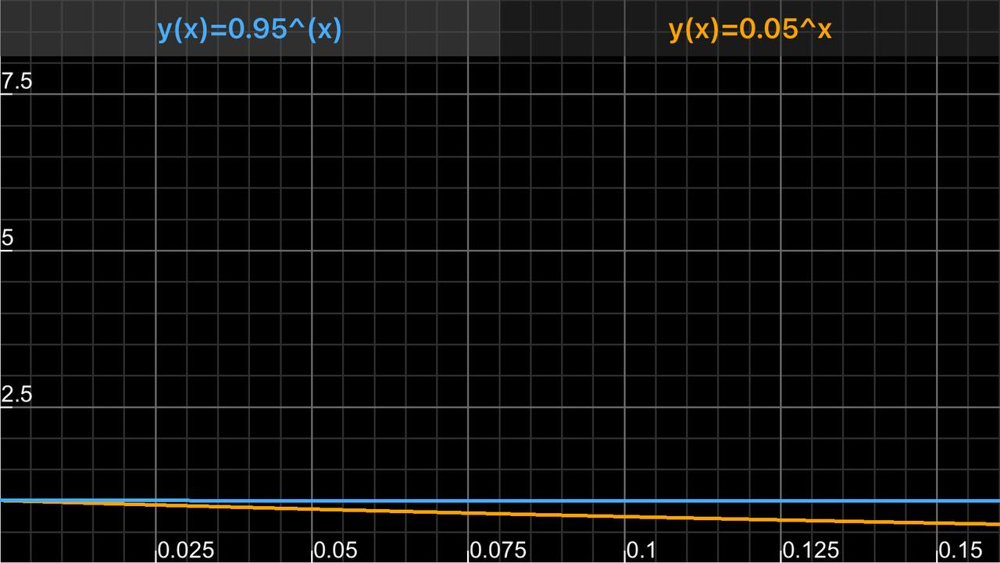

# 15 Binomial Distribution

| day |  Mon  |  Tue  |  Wed  |  Thu  |  Fri  |
|-----|-------|-------|-------|-------|-------|
|  1  |  0.2  |  0.8  |  0.8  |  0.8  |  0.8  | => 0.082
|  2  |  0.8  |  0.2  |  0.8  |  0.8  |  0.8  | => 0.082
|  3  |  0.8  |  0.8  |  0.2  |  0.8  |  0.8  | => 0.082
|  4  |  0.8  |  0.8  |  0.8  |  0.2  |  0.8  | => 0.082
|  5  |  0.8  |  0.8  |  0.8  |  0.8  |  0.2  | => 0.082

Multiply across, add down

$ 5 \times 0.2^1 \times 0.8^4 $

## Binomial Coefficient Formula

$ nCk \rightarrow $ n choose k $ \rightarrow $ of N choices, choose K of them

- n = number of possibilities
- C = choose
- k = desired outcomes

binom(n,k) = $ n C k \cdot p^k \cdot (1-p)^{n-k} $

given: 1 = $ p - q $

binom(n,k) = $ n C x \cdot p^k \cdot q^{n-k} $

binom(20, 0) = $ nCk \rightarrow $

$ (0.05)^0 \cdot (0.95)^{20} \approx 0.358 $

### General Formula

$ p^s \cdot (p-1)^f $

- p -> success -> a year without a flat tire
- (1 - p) -> failure -> A year with a flat tire
- s = successes
- f = failures

### Example

Given:
- p = 0.05
- q = 0.95
- 20 possible outcomes
- Choose zero

binom(20, 0) = $ nCk \rightarrow $

$ (0.05)^0 \cdot (0.95)^{20} \approx 0.358 $

update: Choose 1

binom(20, 1) = $ nCk \rightarrow $

$ (0.05)^1 \cdot (0.95)^{20-1} \rightarrow $

$ 0.05 \cdot (0.95)^{19} \approx 0.018 $

### Example Flat Tires

f(s,f)$ 0.05^s \cdot 0.95^f $

|   p  | f(s) | f(s) |
|------|------|---------|
|   1  | 0.95 | 0.05    |
|   2  | 0.90 | 0.25e-1 |
|   3  | 0.85 | 0.125e-2|
|   4  | 0.81 | 0.625e-5|

